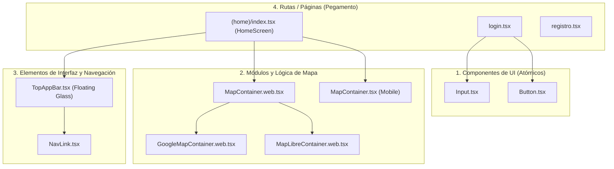

# 🧩 Catálogo y Documentación de Componentes

Este documento ofrece un análisis exhaustivo de los componentes que integran el frontend de la plataforma **App Turismo Map** (`app-turismo`). Está diseñado para que cualquier desarrollador pueda entender cómo se dividen, su nivel de reusabilidad, los parámetros (`props`) que aceptan y la lógica de resolución multiplataforma (Móvil vs. Web).

---

## 🏛️ Clasificación y Jerarquía de Componentes

El proyecto sigue una arquitectura de diseño modular clasificada en tres niveles de granularidad:



---

## 📦 1. Componentes de UI Genéricos (Atómicos)

Ubicados en `src/components/ui/`, representan los bloques de construcción más pequeños de la aplicación. Son **100% reutilizables**, visualmente consistentes con el diseño de Tailwind v4 y libres de acoplamiento lógico con el negocio.

---

### 🔘 Componente: `Button`

Un botón altamente dinámico que envuelve el comportamiento nativo de `TouchableOpacity` de React Native, dando soporte para estados de carga, diferentes tamaños y variantes de color estandarizadas.

* **Ruta del Archivo:** [`app-turismo/src/components/ui/Button.tsx`](file:///c:/Users/grivy/OneDrive/Desktop/Desarrollo/app-turismo-map/app-turismo/src/components/ui/Button.tsx)
* **Reusabilidad:** **Alta (100%)**. Puede usarse en cualquier formulario, modal o vista del sistema.
* **Plataformas Soportadas:** Android, iOS y Web (totalmente adaptado mediante Tailwind).

#### 🛠️ Interfaz de Propiedades (`ButtonProps`)

Acepta todos los atributos estándar de `TouchableOpacityProps` de React Native más los siguientes campos personalizados:

| Propiedad | Tipo | Requerido | Valor por Defecto | Descripción |
| :--- | :--- | :---: | :---: | :--- |
| `label` | `string` | **Sí** | - | El texto visible dentro del botón. |
| `variant` | `'primary' \| 'secondary' \| 'outline' \| 'ghost'` | No | `'primary'` | Define el esquema visual (fondo y bordes). |
| `size` | `'sm' \| 'md' \| 'lg'` | No | `'md'` | Establece el espaciado (padding) e interlineado de texto. |
| `isLoading` | `boolean` | No | `false` | Activa un indicador de carga (`ActivityIndicator`) e inhabilita clics. |
| `disabled` | `boolean` | No | `false` | Deshabilita interacciones y reduce la opacidad al 50%. |

#### 💻 Ejemplo de Uso

```tsx
import { Button } from '@/components/ui';

export default function Example() {
  return (
    <Button
      label="Iniciar Sesión"
      variant="primary"
      size="md"
      isLoading={false}
      onPress={() => console.log('Acción ejecutada')}
    />
  );
}
```

---

### 📝 Componente: `Input`

Un campo de entrada de texto premium que integra etiquetas, soporte para iconos a la izquierda o derecha, manejo de errores de validación y un selector de visibilidad integrado si detecta campos de contraseña (`secureTextEntry`).

* **Ruta del Archivo:** [`app-turismo/src/components/ui/Input.tsx`](file:///c:/Users/grivy/OneDrive/Desktop/Desarrollo/app-turismo-map/app-turismo/src/components/ui/Input.tsx)
* **Reusabilidad:** **Alta (100%)**. Diseñado para recopilar información de usuario de manera segura y estilizada.
* **Plataformas Soportadas:** Android, iOS y Web.

#### 🛠️ Interfaz de Propiedades (`InputProps`)

Acepta todas las propiedades nativas de `TextInputProps` de React Native más los siguientes campos:

| Propiedad | Tipo | Requerido | Descripción |
| :--- | :--- | :---: | :--- |
| `label` | `string` | No | Etiqueta superior sobre el campo. |
| `error` | `string` | No | Mensaje de validación inferior en color rojo que también tiñe los bordes del input. |
| `leftIcon` | `keyof typeof Ionicons.glyphMap` | No | Icono de la librería `Ionicons` a mostrar al inicio del campo. |
| `rightIcon` | `keyof typeof Ionicons.glyphMap` | No | Icono de `Ionicons` al extremo derecho del campo. |
| `onRightIconPress` | `() => void` | No | Función callback cuando se presiona el icono de la derecha. |
| `containerStyle` | `StyleProp<ViewStyle>` | No | Estilos Inline adicionales para el contenedor principal de la vista. |

#### 💻 Ejemplo de Uso

```tsx
import React, { useState } from 'react';
import { Input } from '@/components/ui';

export default function LoginForm() {
  const [email, setEmail] = useState('');
  
  return (
    <Input
      label="Correo Electrónico"
      placeholder="tu@correo.com"
      leftIcon="mail-outline"
      value={email}
      onChangeText={setEmail}
      error={email.includes('@') ? undefined : 'Correo inválido'}
    />
  );
}
```

---

## 🗺️ 2. Componentes de Renderizado de Mapa

Estos componentes en `src/components/Map/` manejan la visualización interactiva y el renderizado multiplataforma del mapa principal. El sistema se sirve del sistema de empaquetado de Expo para compilar una versión nativa o web según la plataforma física.

---

### 📱 Componente: `MapContainer` (Móvil Nativo)

Componente de alto rendimiento diseñado para renderizar mapas en Android e iOS mediante la biblioteca nativa `react-native-maps`.

* **Ruta del Archivo:** [`app-turismo/src/components/Map/MapContainer.tsx`](file:///c:/Users/grivy/OneDrive/Desktop/Desarrollo/app-turismo-map/app-turismo/src/components/Map/MapContainer.tsx)
* **Reusabilidad:** **Baja / Específico**. Está acoplado a la lógica de eventos turísticos, la capa de proveedor y el modo táctico militar/geográfico.
* **Plataformas Soportadas:** Android e iOS.
* **Optimizaciones Clave:**
  - Marcadores de eventos memoizados dinámicamente (`EventMarker = React.memo(...)`) con comparación selectiva de props.
  - El parámetro `tracksViewChanges` se bloquea después de 600ms para evitar re-capturas constantes de la vista y maximizar la fluidez.
  - Desactivación de rotación, renderizado de edificios 3D y POIs adicionales de Google para liberar la GPU en dispositivos de gama media y baja.

#### 🛠️ Interfaz de Propiedades (`MapContainerProps`)

Compartida entre las implementaciones nativa y web en [`types.ts`](file:///c:/Users/grivy/OneDrive/Desktop/Desarrollo/app-turismo-map/app-turismo/src/components/Map/types.ts):

| Propiedad | Tipo | Requerido | Descripción |
| :--- | :--- | :---: | :--- |
| `events` | `TurismoEvent[]` | **Sí** | Arreglo de los eventos turísticos que se marcarán en el mapa. |
| `selectedEvent` | `TurismoEvent \| null` | **Sí** | Evento que está actualmente seleccionado por el usuario para animar la cámara. |
| `onSelectEvent` | `(event: TurismoEvent \| null) => void` | **Sí** | Callback ejecutado cuando se toca un marcador o se limpia la selección. |
| `mapLayer` | `'dark' \| 'streets' \| 'satellite' \| 'terrain'` | **Sí** | Estilo visual actual de los mapas y capas. |
| `userLocation` | `{ latitude: number; longitude: number } \| null` | No | Geolocalización GPS del dispositivo en tiempo real. |
| `centerTrigger` | `number` | No | Contador numérico secuencial que fuerza el centrado de la cámara sobre el usuario. |
| `tacticalMode` | `boolean` | No | Activa la mira táctica en cruz sobre la pantalla para calcular coordenadas en el centro. |
| `onTacticalLocationChange` | `(location) => void` | No | Retorna en vivo la latitud y longitud del mapa mientras el usuario arrastra la vista. |

---

### 🌐 Conmutador Web: `MapContainer.web.tsx`

Un archivo ligero que intercepta las peticiones web y distribuye el renderizado al motor adecuado de Google Maps o MapLibre GL en base a variables de configuración del sistema (`MAP_CONFIG.provider`).

* **Ruta del Archivo:** [`app-turismo/src/components/Map/MapContainer.web.tsx`](file:///c:/Users/grivy/OneDrive/Desktop/Desarrollo/app-turismo-map/app-turismo/src/components/Map/MapContainer.web.tsx)
* **Reusabilidad:** **Baja / Puente**. Actúa como un *router* de componentes para web.
* **Plataformas Soportadas:** Web (Navegadores de escritorio y móvil).

#### Lógica de Conmutación:
```tsx
export function MapContainer(props: MapContainerProps) {
  if (MAP_CONFIG.provider === 'google') {
    return <GoogleMapContainer {...props} />;
  }
  return <MapLibreContainer {...props} />; // Capa de código abierto de respaldo
}
```

---

### 🌐 Componente: `GoogleMapContainer.web.tsx`

Implementación del mapa web de alto nivel basada en la API de Google Maps JavaScript a través de la suite oficial de `@vis.gl/react-google-maps`.

* **Ruta del Archivo:** [`app-turismo/src/components/Map/GoogleMapContainer.web.tsx`](file:///c:/Users/grivy/OneDrive/Desktop/Desarrollo/app-turismo-map/app-turismo/src/components/Map/GoogleMapContainer.web.tsx)
* **Reusabilidad:** **Baja (Específico Web)**.
* **Características Destacadas:**
  - Soporte de marcadores avanzados (`AdvancedMarker` y `Pin`) para inyectar vectores responsivos.
  - Panel de control de Zoom flotante emulando el Glassmorphism del `AppNavbar`.
  - Tratamiento visual de errores nativo de la consola de desarrollo de Google Cloud (`ApiNotActivatedMapError`).

---

### 🌐 Componente: `MapLibreContainer.web.tsx`

Alternativa de código abierto de altísima eficiencia basada en **MapLibre GL** y renderizado por canvas vectorizado para evitar cobros de licencias comerciales.

* **Ruta del Archivo:** [`app-turismo/src/components/Map/MapLibreContainer.web.tsx`](file:///c:/Users/grivy/OneDrive/Desktop/Desarrollo/app-turismo-map/app-turismo/src/components/Map/MapLibreContainer.web.tsx)
* **Reusabilidad:** **Baja (Específico Web)**.
* **Características Destacadas:**
  - Integra capas de azulejos (tiles) vectoriales dinámicos libres (ej. OpenFreeMap).
  - Interactúa directamente con el DOM mediante React Roots (`createRoot(el)`) para instanciar marcadores interactivos ultraligeros.
  - Implementa un cálculo de colisiones y cursor táctico interactivo con un indicador SVG en tiempo real.

---

## 🧭 3. Componentes de Interfaz de Navegación (MapUI)

Localizados en `src/components/MapUI/`, resuelven las interacciones flotantes y de control sobre la pantalla del mapa.

---

### 🛸 Componente: `TopAppBar` (Floating Glass Navbar)

Una barra de navegación flotante elegante que sigue las directrices del estilo **Glassmorphism**. Actúa como control maestro de pestañas/menús.

* **Ruta del Archivo:** [`app-turismo/src/components/MapUI/Header/TopAppBar.tsx`](file:///c:/Users/grivy/OneDrive/Desktop/Desarrollo/app-turismo-map/app-turismo/src/components/MapUI/Header/TopAppBar.tsx)
* **Reusabilidad:** **Media / Modular**. Pensada para la navegación de la suite de turismo, pero aislada de rutas fijas para poder ser incrustada en cualquier pantalla superior.
* **Ajustes Estilísticos:**
  - Fondo carbón translúcido (`rgba(34, 34, 34, 0.55)`).
  - Efecto de desfoque posterior (`backdropFilter: 'blur(10px)'` en Web) para traslucir el mapa en movimiento.
  - Sombra sutil regulada según plataforma (`elevation: 8` en Android, `shadowRadius: 10` en iOS).

#### 🛠️ Interfaz de Propiedades (`TopAppBarProps`)

En [`types.ts`](file:///c:/Users/grivy/OneDrive/Desktop/Desarrollo/app-turismo-map/app-turismo/src/components/MapUI/types.ts):

| Propiedad | Tipo | Requerido | Descripción |
| :--- | :--- | :---: | :--- |
| `currentTab` | `'map' \| 'forum' \| 'saved' \| 'settings' \| 'profile'` | No | Tab seleccionado actualmente. |
| `onTabChange` | `(tab: TabType) => void` | No | Callback al cambiar de pestaña. |

#### 💻 Ejemplo de Uso
```tsx
import { TopAppBar } from '@/components/MapUI';

export default function Layout() {
  const [tab, setTab] = useState('map');
  return <TopAppBar currentTab={tab} onTabChange={setTab} />;
}
```

---

### 🔗 Componente: `NavLink`

Botones internos adaptativos utilizados por el `TopAppBar` para distribuir la selección de pestañas.

* **Ruta del Archivo:** [`app-turismo/src/components/MapUI/Header/NavLink.tsx`](file:///c:/Users/grivy/OneDrive/Desktop/Desarrollo/app-turismo-map/app-turismo/src/components/MapUI/Header/NavLink.tsx)
* **Reusabilidad:** **Alta (Interna/Layout)**.
* **Dinámica:** Si el botón no recibe la propiedad `label`, reduce su espaciado horizontal automático (`paddingHorizontal: 12`) para transformarse en un botón puramente circular de icono (`iconOnly`), perfecto para móviles.

#### 🛠️ Interfaz de Propiedades (`NavLinkProps`)

| Propiedad | Tipo | Requerido | Descripción |
| :--- | :--- | :---: | :--- |
| `icon` | `string` | **Sí** | Identificador del icono de la familia `MaterialIcons`. |
| `label` | `string` | No | Texto que acompaña al icono. Si se omite, el botón se compacta. |
| `active` | `boolean` | No | Aplica el realce visual de fondo traslúcido blanco (`rgba(255, 255, 255, 0.15)`). |
| `onClick` | `() => void` | No | Callback cuando se presiona la pestaña. |

---

## 🛠️ Resumen de Niveles de Reusabilidad

Para facilitar el mantenimiento, la siguiente tabla agrupa rápidamente cada componente según su reusabilidad general en el código:

| Componente | Nivel de Reusabilidad | Acoplamiento de Negocio | Ubicación del Archivo |
| :--- | :---: | :---: | :--- |
| **`Button`** | 🟢 **100% Reutilizable** | Ninguno (Atómico) | `src/components/ui/Button.tsx` |
| **`Input`** | 🟢 **100% Reutilizable** | Ninguno (Atómico) | `src/components/ui/Input.tsx` |
| **`NavLink`** | 🟡 **Medio-Alto** | Estilos de Navbar | `src/components/MapUI/Header/NavLink.tsx` |
| **`TopAppBar`** | 🟡 **Media** | Navegación Principal | `src/components/MapUI/Header/TopAppBar.tsx` |
| **`MapContainer`** | 🔴 **Bajo (Específico)** | Geolocalización/Eventos | `src/components/Map/MapContainer.tsx` |
| **`GoogleMapContainer`** | 🔴 **Bajo (Específico Web)** | Google Maps API | `src/components/Map/GoogleMapContainer.web.tsx` |
| **`MapLibreContainer`** | 🔴 **Bajo (Específico Web)** | MapLibre API | `src/components/Map/MapLibreContainer.web.tsx` |

---

## 🚀 Arquitectura Multiplataforma (.web.tsx)

El proyecto utiliza una estrategia extremadamente limpia para separar el comportamiento web del nativo móvil sin duplicar lógica de negocio innecesaria:

1. **Resolución de Extensiones**: Expo y Metro Bundler resuelven de forma prioritaria la extensión `.web.tsx` sobre `.tsx` cuando compilan para el navegador.
2. **Abstracción Limpia**:
   - En **Móviles**, se carga [`MapContainer.tsx`](file:///c:/Users/grivy/OneDrive/Desktop/Desarrollo/app-turismo-map/app-turismo/src/components/Map/MapContainer.tsx) que llama a `react-native-maps` mediante su puente C++ nativo de Google/Apple Maps.
   - En **Web**, se redirige a [`MapContainer.web.tsx`](file:///c:/Users/grivy/OneDrive/Desktop/Desarrollo/app-turismo-map/app-turismo/src/components/Map/MapContainer.web.tsx) cargando librerías JavaScript puras optimizadas para DOM como `@vis.gl/react-google-maps` o `maplibre-gl` sin sobrecargar el paquete móvil.
3. **Estilos Unificados**: A través de **Tailwind CSS v4 (NativeWind)**, las mismas clases de utilidad se traducen en estilos CSS reactivos nativos en Android/iOS y en hojas de estilo HTML estándar en Web, asegurando coherencia visual absoluta.
