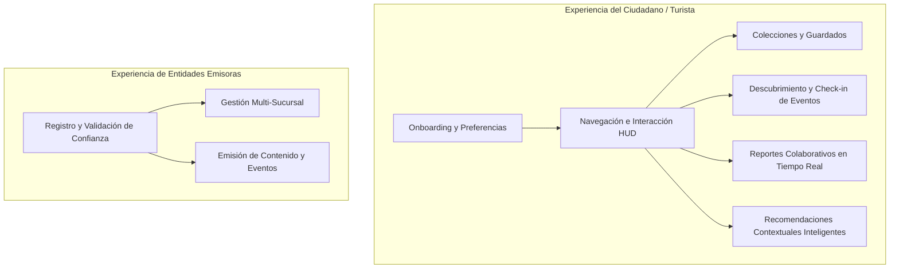

# Brief del Producto: Plataforma de Turismo Geoespacial

Este documento presenta una descripción de alto nivel del producto desarrollada para el cliente. Define la naturaleza del software, la arquitectura tecnológica que hace posible la geolocalización y los flujos clave que experimentarán los usuarios en la plataforma.

---

## 1. ¿Qué tipo de software estamos desarrollando?

Estamos desarrollando una **plataforma interactiva de turismo geoespacial multiplataforma (móvil y web)** de última generación. El software está diseñado bajo la filosofía visual de *"Island Design"*, donde la interfaz de usuario se compone de módulos flotantes y semi-transparentes que descansan de manera orgánica sobre un mapa interactivo inmersivo y continuo.

El objetivo central de la plataforma es dinamizar y enriquecer la experiencia de turistas y ciudadanos locales, sirviendo de puente con la economía y oferta local. A través de un ecosistema digital integrado, la plataforma permite:
*   **Conectar actores locales:** Unifica en un solo mapa a los ciudadanos (turistas/locales), los comercios físicos (hoteles, cafeterías), creadores de contenido (influencers, guías turísticos) y medios de comunicación oficiales.
*   **Interactividad en tiempo real:** Ofrece a los usuarios la capacidad de visualizar el pulso de la ciudad mediante reportes ciudadanos instantáneos y eventos dinámicos.
*   **Personalización inteligente:** Sugiere experiencias y rutas a medida basadas en las preferencias del usuario, su ubicación geográfica y factores contextuales externos como el clima actual y la hora del día.

---

## 2. Tecnologías de Geolocalización y Mapas

Para ofrecer una experiencia de nivel premium optimizada para cada pantalla, implementamos una **arquitectura de mapas híbrida** que balancea de forma impecable el rendimiento técnico y la eficiencia de costos:

### A. Motor de Mapas Híbrido (Multiplataforma)
*   **En Dispositivos Móviles (iOS y Android):** La aplicación nativa utiliza un motor basado en **cartografía nativa acelerada por hardware** a través de Google Maps. Esto asegura gestos ultra-fluidos, un renderizado de alto rendimiento de pines y una integración natural con las capacidades físicas de los dispositivos móviles.
*   **En la Versión Web (Navegador):** Con el fin de mitigar los elevados costos de licenciamiento de la API de Google Maps en entornos web, hemos desarrollado un visualizador basado en tecnología de **renderizado vectorial de alto rendimiento (MapLibre GL)** utilizando el estilo **CARTO Dark Matter**. Esto provee una cartografía interactiva en un elegante "Tema Oscuro" nativo que se ejecuta a 60 fotogramas por segundo directamente en el navegador, sin costo por visualizaciones.

### B. Sistema de Telemetría Avanzada
El mapa va más allá de un indicador estático de ubicación. Incorpora un avanzado módulo de telemetría en tiempo real:
*   **Captura Telemétrica de Alta Precisión:** El software captura dinámicamente coordenadas GPS precisas, altitud sobre el nivel del mar, precisión de la señal móvil y velocidad instantánea (convertida de forma automatizada a km/h).
*   **Orientación Espacial Dinámica:** La aplicación interactúa directamente con el magnetómetro (brújula física) del dispositivo móvil (y eventos de orientación giroscópica en web). Esto permite proyectar en el mapa un **cono de visión o haz direccional** que gira automáticamente según hacia dónde apunte la cámara del usuario en el espacio físico.
*   **HUD Telemetría (Glassmorphism):** La interfaz móvil presenta un panel flotante de telemetría en vivo semi-transparente que muestra un velocímetro digital, altímetro y una brújula analógica interactiva.

### C. Infraestructura Geoespacial en el Servidor (Backend)
*   **Base de Datos Espacial:** En el servidor, toda la información geográfica y de sucursales se almacena y procesa utilizando extensiones espaciales avanzadas (**PostGIS**), mediante el uso de coordenadas geométricas precisas en lugar de valores decimales planos. Esto permite realizar cálculos matemáticos de cercanía y rutas directamente en la base de datos de manera ultrarrápida.
*   **Indexación y Caché en Tiempo Real:** Implementamos indexación geoespacial espacial (GIST) en la base de datos para realizar búsquedas inmediatas. Complementariamente, se utiliza una capa de caché de alto rendimiento (**Redis GEO**) para procesar notificaciones y alertas de proximidad instantáneas basadas en un radio de metros a la redonda.

---

## 3. Flujos de Usuario del Sistema

La experiencia de la plataforma se divide en dos grandes caminos diseñados para satisfacer las necesidades específicas de cada tipo de perfil de usuario:

### 👤 Flujo del Ciudadano (Turistas y Locales)

Este flujo prioriza el descubrimiento intuitivo y la interacción ágil con el entorno.

1.  **Onboarding y Selección de Intereses:** 
    Al iniciar la aplicación por primera vez, el usuario realiza un recorrido rápido donde selecciona sus intereses turísticos o recreativos primarios (por ejemplo: gastronomía local, naturaleza y senderos, historia y museos, cerveza artesanal, cafeterías). Estas preferencias se guardan de forma segura para moldear toda la experiencia del mapa.
2.  **Exploración del Mapa Interactivo:**
    El usuario navega libremente por la ciudad a través del mapa inmersivo. El HUD de telemetría flotante se actualiza en tiempo real mostrando los datos de navegación, velocidad y orientación espacial a medida que el usuario camina o conduce por el sector.
3.  **Colecciones y Lugares Favoritos ("Mis Guardados"):**
    Permite al usuario crear listas temáticas personalizadas (ej. *"Ruta de Cafés con Chimenea"*, *"Playa y Parques"*), guardar puntos de interés descubiertos en el mapa, y agregar notas privadas sobre sus experiencias en cada lugar.
4.  **Descubrimiento y Check-in de Eventos:**
    El mapa destaca eventos activos y futuros en la zona con pines animados. El usuario puede marcar su intención de asistencia (*"Asistiré"* o *"Me interesa"*). Al llegar físicamente al lugar del evento, la aplicación utiliza la telemetría GPS para validar su cercanía exacta y permitirle realizar un **Check-in verificado**, lo que habilita recompensas de fidelización o insignias digitales de exploración.
5.  **Reportes Colaborativos en Tiempo Real (Crowdsourcing):**
    Mediante un botón de acceso rápido en el mapa (al estilo Waze), los usuarios pueden alertar a la comunidad sobre eventos temporales usando su geolocalización automática. Las opciones simplificadas incluyen: *Alta Congestión de Público*, *Incidencias en la Vía*, o *Local Temporalmente Cerrado*.
6.  **Recomendaciones Contextuales Inteligentes:**
    Un carrusel flotante dinámico entrega recomendaciones que cambian de forma inteligente según el entorno:
    *   *Si llueve:* Recomienda cafeterías con chimenea o museos cercanos.
    *   *Si hay sol por la tarde:* Sugiere miradores, parques naturales y paseos junto al río.
    *   *Según la hora:* Promociona locales de desayuno por la mañana, almuerzos al mediodía y cervecerías locales por la noche.

---

### 🏢 Flujo de Entidades Emisoras (Comercios, Creadores y Prensa)

Este flujo está diseñado para dar visibilidad comercial y control operativo a los actores que dinamizan la ciudad.

1.  **Registro y Verificación Concierge:**
    Los comercios (`business`), periodistas independientes (`media`) y creadores de contenido o guías (`creator`) solicitan su registro en la plataforma. Con el fin de proteger el ecosistema contra la desinformación y el spam, los administradores validan manualmente cada solicitud antes de activarla. Al ser verificados, se les otorga una **Insignia de Confianza (Check de Verificación)** que aparecerá de forma prominente en sus pines del mapa.
2.  **Gestión de Sucursales y Colaboradores (Comercios):**
    El propietario de un comercio accede a un panel de control avanzado que le permite:
    *   Crear y gestionar múltiples sucursales físicas en el mapa, definiendo sus coordenadas geoespaciales específicas.
    *   Invitar a colaboradores o personal de su equipo de manera segura mediante el uso de enlaces transaccionales únicos.
3.  **Emisión de Contenido y Eventos en el Mapa:**
    Las entidades emisoras pueden publicar sus propios eventos, promociones o reportes oficiales directamente en el mapa. El panel les proporciona métricas sobre el impacto de sus emisiones, permitiéndoles cuantificar el volumen de visitas virtuales a sus perfiles y el número de confirmaciones de asistencia a sus eventos.

---

*Documentos de diseño y arquitectura relacionados:* [[Modelo de Cuentas y Roles]] | [[Arquitectura y Flujo de Usuarios]] | [[TELEMETRIA Y MAPLIBRE]] | [[Hoja de Ruta y Flujos del Sistema]]
