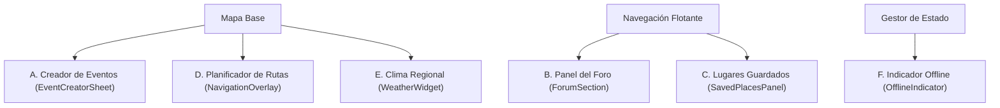

## Brand & Style
The design system focuses on the "Island Design" philosophy, where UI elements float as distinct, self-contained modules over a continuous map background. The brand personality is serene, adventurous, and modern, capturing the mist-covered rainforests and winding rivers of Valdivia.

The interface utilizes a sophisticated Minimalism blended with Glassmorphism to ensure the map remains the primary navigational context. The emotional response should be one of fluid exploration—mimicking the gentle flow of the Calle-Calle river. Every surface is treated as a physical layer with soft depth, providing a tactile feel that remains lightweight and unobtrusive.

## Colors
The palette is rooted in the natural ecosystem of southern Chile.
- **Primary (Forest Green):** A deep, saturated green representing the temperate rainforest. Used for primary branding and key action paths.
- **Secondary (River Blue):** A calm, deep blue for water-related activities, transport, and secondary navigation.
- **Accent (Sunset Gold):** A vibrant orange-yellow reserved exclusively for live events, active map pins, and critical calls-to-action to ensure high visibility against greens and blues.
- **Surface:** Pure white (#FFFFFF) is used for floating cards to provide maximum contrast.
- **Background:** The "system background" is the map itself, while ultra-light gray (#F8F9FA) is used for inactive states or background scrums.

## Typography
This design system employs **Inter** for its systematic clarity and neutral tone, allowing the photography and map visuals to lead. 

The hierarchy is built on tight leading and slight negative letter-spacing for headlines to create a premium, editorial feel. Labels use increased tracking and uppercase styling to provide a clear functional distinction from descriptive body text. On mobile devices, the largest headlines scale down to maintain a comfortable reading width without overwhelming the floating card layouts.

## Layout & Spacing
The layout follows a "Floating Island" model rather than a traditional grid. 
- **The Map Base:** The bottom-most layer, always visible through gaps between UI islands.
- **Floating Margins:** All UI elements must maintain a minimum 20px (1.25rem) distance from the screen edges to reinforce the floating effect.
- **Vertical Rhythm:** Elements are stacked with 16px gaps. 
- **Bottom Sheets:** These utilize a "detached" style where the sheet does not touch the bottom of the screen but floats 12px above the home indicator, mimicking an island.

## Elevation & Depth
Depth is the most critical factor in this design system. It is achieved through:
- **Soft Ambient Shadows:** Instead of harsh drops, use extra-diffused shadows with a 20px-40px blur radius at 8-10% opacity, tinted with the Primary green (#1A4335) to ground the elements.
- **Tonal Layering:** The primary floating cards sit at the highest elevation. Secondary details (like filter chips) sit on top of cards with subtle 1px inner strokes rather than more shadows.
- **Background Blur:** When a Bottom Sheet or Modal is active, the map background receives a 10px Gaussian blur to pull the user's focus into the "island."
- **Obsidian Glassmorphism:** Core navigation controls and interactive toolbars utilize a dark, semi-transparent charcoal background (`rgba(34, 34, 34, 0.55)`) combined with a 1px border highlight (`rgba(255, 255, 255, 0.1)`) and a `10px` blur to overlay cleanly on top of map tiles while preserving legibility and depth.

## Shapes
The shape language is ultra-rounded to feel organic and friendly. 
- **Floating Cards:** Use a minimum 24px corner radius.
- **Buttons & Search Bars:** Use full pill-shaped (rounded-full) styling to distinguish interactive elements from informational cards.
- **Interactive States:** On press, elements should subtly scale down (98%) rather than just changing color, enhancing the tactile "squishy" feel of the interface.

## Components
- **Floating Search Bar:** A pill-shaped input floating at the top of the map. It features a semi-transparent glass backdrop (80% opacity) and a Primary color icon.
- **Map Markers:** Distinctive circular pins with a 2px white border. Active pins for "Live Events" feature a pulsing outer ring in Sunset Gold.
- **Elegant Bottom Sheets:** Detached islands with a 24px radius and a subtle "grabber" handle at the top. They should glide in with a spring-based animation.
- **Action Chips:** Small, pill-shaped filters used to toggle map categories (e.g., "Parks," "Museums"). When active, they take the River Blue color; when inactive, they are semi-transparent white with a thin border.
- **Quick-Action FABs:** Circular buttons for "Locate Me" or "Weather," floating independently on the right side of the screen with a high-diffusion shadow.
- **Unified Navigation Toolbar (Obsidian Glass Control Bar):** A compact, vertical, pill-shaped toolbar that groups all navigation and map controls (Zoom in, Zoom out, locate me, precision focus, and filters toggle). It uses a translucent charcoal backdrop (`rgba(34, 34, 34, 0.55)`), a micro-border `rgba(255, 255, 255, 0.1)`, a Gaussian background blur of `10px`, and compact `36px` round-corner square buttons with active states using `rgba(255, 255, 255, 0.15)` and highlights in active green (`#34D399`).

---

## 🚀 Especificaciones del Software y Roadmap de Componentes

En base al análisis de los requisitos y la estructura técnica actual, hemos definido el tipo de software que estamos desarrollando, sus características de estándar en la industria y el roadmap de componentes pendientes para consolidar la plataforma.

---

### 1. ¿Qué Tipo de Software Estamos Desarrollando?

Estamos desarrollando una **Plataforma SaaS de Geoturismo Colaborativo y Eventos en Tiempo Real** (Real-Time Collaborative Geotourism SaaS). 

Desde la perspectiva técnica y de producto, el software se define como una **Aplicación SIG (Sistema de Información Geográfica) Social de Eventos Dinámicos**. No es simplemente un mapa estático de puntos de interés, sino un ecosistema vivo e interactivo donde la información cambia al instante en base a las acciones de los usuarios y flujos de datos asíncronos.

#### 🌟 Estándares y Características de la Industria que Sigue este Software:

1. **Arquitectura Híbrida Universal (Expo/React Native)**: Capacidad para empaquetarse de forma nativa en móviles (iOS/Android) y a su vez renderizarse en la Web optimizando la carga en navegadores de escritorio de forma fluida.
2. **Arquitectura Basada en Eventos (Event-Driven Real-Time)**: Sincronización asíncrona mediante WebSockets en tiempo real, permitiendo conectar a múltiples clientes y reflejar pines agregados al instante.
3. **Island Design & Glassmorphism UI**: La interfaz minimiza la sobrecarga visual mediante tarjetas e islas de interacción flotantes con fondos carbón y blancos semitransparentes, manteniendo el mapa en pantalla completa como el contexto primario.
4. **Geospatial Mobile First**: Fuerte orientación hacia el GPS del smartphone, sensores de orientación en tiempo real (brújula) y gestos táctiles optimizados para manejo espacial de mapas.
5. **Caché y Resiliencia Offline**: Diseñado para funcionar en áreas de nula o baja conectividad móvil (común en reservas naturales como la Selva Valdiviana) con carga optimizada de recursos estáticos.

---

### 2. Componentes Faltantes y Comportamiento Requerido

Actualmente, el proyecto cuenta con el renderizado base de mapas, control de capas, geolocalización en vivo de usuario y pantallas de perfil. Para completar el alcance del software propuesto en el diseño, se deben desarrollar e integrar los siguientes componentes dinámicos:

#### ✍️ A. Creador de Eventos Colaborativos (`EventCreatorSheet` / `EventCreatorModal`)
* **Comportamiento**: Un Bottom Sheet flotante e interactivo que se despliega automáticamente cuando un usuario realiza un "long-press" (pulsación prolongada) sobre cualquier coordenada del mapa o presiona el FAB de agregar tras activar el **Modo Táctico**. Captura inmediatamente la latitud y longitud seleccionadas para alimentar los campos geográficos sin esfuerzo del usuario.
* **Datos requeridos y recolectados**:
  - **Ubicación Espacial**: Latitud y longitud exactas (tipo `float64`).
  - **Metadata del Reporte**: Título, descripción detallada, categoría (gastronomía, cultura, naturaleza, música, deportes), fecha/horario de inicio y finalización del evento.
  - **Identidad y Privacidad**: ID del usuario creador (vinculado a JWT seguro) y fecha de creación.
  - **Soporte Multimedia**: Posibilidad de adjuntar imágenes (subidas como `multipart/form-data` al backend de Go para almacenamiento en la nube S3/CDN, guardando la URL en la base de datos).

#### 💬 B. Panel de Discusión Local en Tiempo Real (`ForumSection` / `ChatSection`)
* **Comportamiento**: Consumido al presionar el tab "Foro" en el `TopAppBar` o mediante accesos directos desde un evento en el mapa. Muestra un canal de conversación dinámica (estilo chat grupal o hilos de foro) donde los visitantes de la Selva Valdiviana pueden interactuar, subir actualizaciones de las condiciones en ruta, opinar y reportar alertas.
* **Datos requeridos y recolectados**:
  - **Mensajería**: Contenido de texto, ID del autor, foto de perfil/username y timestamp.
  - **Contexto**: ID del evento asociado para filtrar hilos específicos de un festival/actividad, o coordenadas del hilo si es una conversación general de una zona de interés.
  - **Moderación**: Reportes de spam o información engañosa.

#### 🔖 C. Administrador de Lugares Guardados (`SavedPlacesPanel`)
* **Comportamiento**: Un contenedor flotante de tipo Bottom Sheet / Side Panel activado por el botón correspondiente del Navbar. Permite ver de forma ordenada las marcas de eventos turísticos o localizaciones salvadas por el usuario. Al pulsar sobre cualquier elemento, la cámara realiza una interpolación suave (flyTo/animateToRegion) enfocando las coordenadas específicas.
* **Datos requeridos y recolectados**:
  - **Asociaciones**: Lista de IDs de eventos guardados por el usuario activo.
  - **Sincronización**: Cacheo local de lectura rápida (`AsyncStorage`) y sincronización bidireccional asíncrona con la base de datos central en Go.

#### 🛣️ D. Planificador de Rutas e Indicaciones Interactivas (`NavigationOverlay`)
* **Comportamiento**: Panel minimalista superpuesto que aparece al pulsar el botón "Cómo llegar" de un evento. Utiliza APIs de mapas para trazar una polilínea visual desde la posición del usuario en tiempo real hasta la del evento, mostrando la distancia restante en metros/kilómetros, el tiempo de llegada y una guía secuencial paso a paso de navegación.
* **Datos requeridos y recolectados**:
  - **Puntos de Enrutamiento**: Lat/Lng de inicio (GPS local del usuario) y Lat/Lng de llegada (Coordenadas de destino).
  - **Métricas de Tránsito**: Distancia de la ruta calculada (metros), estimación del tiempo de arribo (segundos) e instrucciones textuales del trayecto.
  - **Geometría**: Serie de coordenadas de la polilínea codificada recuperadas desde servidores OSRM, Valhalla o Google Directions.

#### ☀️ E. Widget y Capa Climatológica Local (`WeatherWidget` / `WeatherOverlay`)
* **Comportamiento**: Control flotante estético de tipo circular que consulta en tiempo real las condiciones meteorológicas del mapa visualizado. En zonas lluviosas y de selva como Valdivia, advierte de manera predictiva mediante un banner flotante de color si el pronóstico meteorológico es desfavorable (lluvias torrenciales, vientos) para realizar actividades al aire libre o de senderismo.
* **Datos requeridos y recolectados**:
  - **Ubicación de Consulta**: Coordenadas centrales del mapa activo en pantalla.
  - **Datos del Tiempo**: Temperatura actual (°C), humedad (%), porcentaje de nubosidad, velocidad de viento (km/h) y avisos climáticos recopilados mediante APIs de OpenWeatherMap.

#### 📴 F. Indicador de Conectividad y Cola de Sincronización (`OfflineIndicator`)
* **Comportamiento**: Una pequeña barra superior con un micro-animación en rojo/alerta que aparece discretamente cuando se pierde la conexión de datos o red. Congela el mapa en un estado "Solo Lectura" cargado en caché local, evitando caídas abruptas de pantalla, e inicia una cola asíncrona para guardar localmente las peticiones del usuario que se enviarán al recuperar red.
* **Datos requeridos y recolectados**:
  - **Conexión de Red**: Monitoreo de estado a través de `NetInfo` en móviles.
  - **Cola de Pendientes Offline**: Estructura de base de datos SQLite / AsyncStorage en el dispositivo que encola peticiones HTTP fallidas para su re-intento automático cuando la conexión se estabiliza.