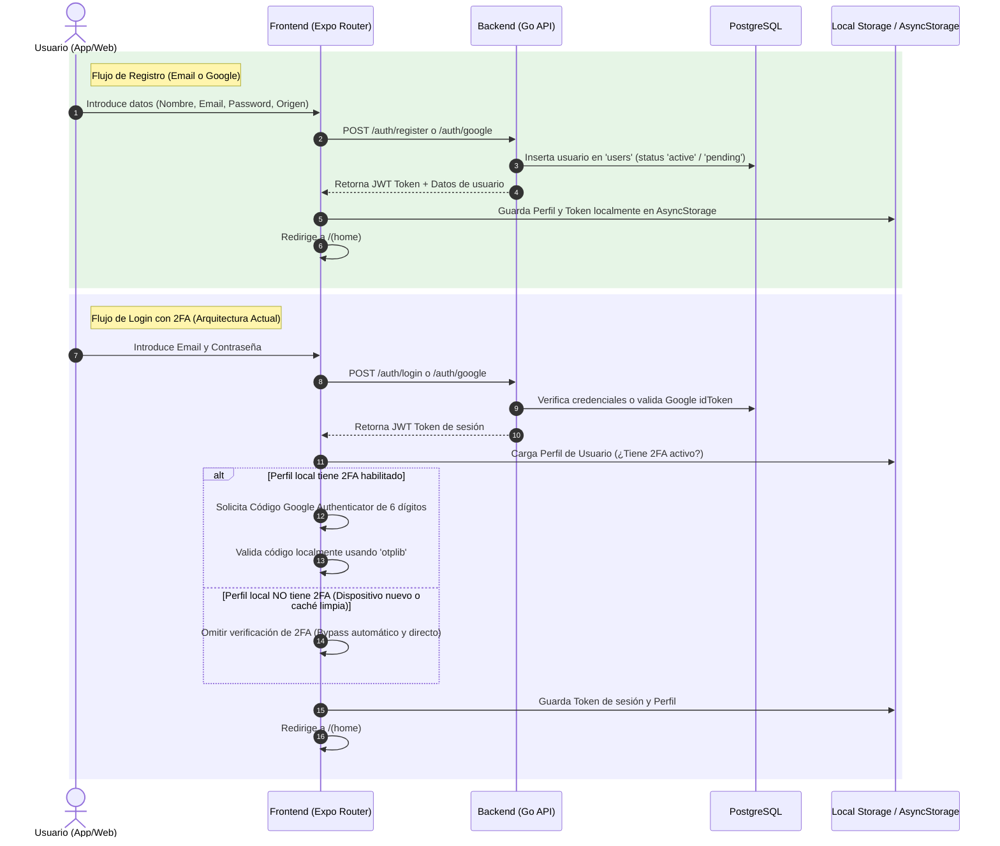
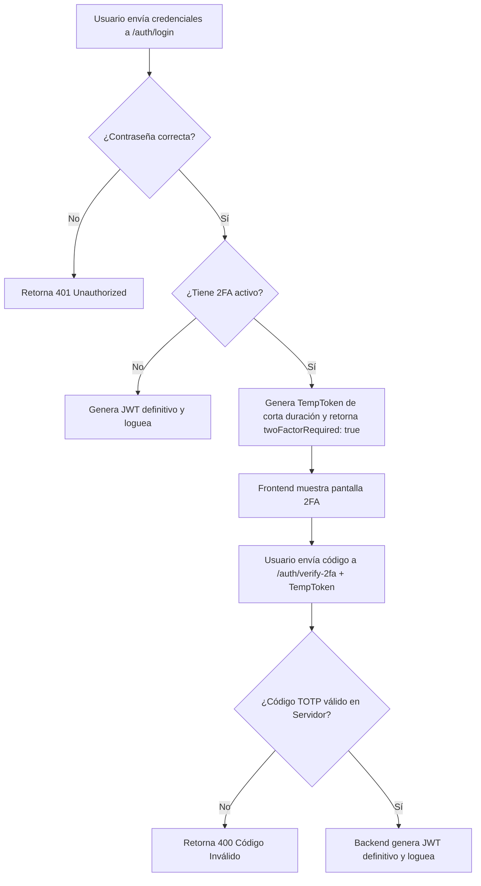

# Análisis de Flujos de Autenticación y Seguridad (Login, Registro y 2FA)

Este documento detalla el análisis arquitectónico, los diagramas de secuencia y la evaluación de riesgos de los flujos de inicio de sesión, registro y verificación de doble factor (2FA) en la aplicación móvil/web (**Expo**) y el servidor (**Go API**).

---

## 🗺️ Mapa de Flujos e Interacciones Actuales

El siguiente diagrama muestra secuencialmente cómo interactúa el cliente frontend con el backend en Go y el almacenamiento local durante los flujos de autenticación:



---

## 🔍 Análisis Técnico por Componente

### 1. Inicialización y Gestión del Token (`app/index.tsx` & `authStorage.ts`)
*   **Mecanismo:** La aplicación arranca en `app/index.tsx` y ejecuta un `useEffect` que llama a `getAuthToken()`. Si encuentra un token activo, realiza una redirección limpia usando `router.replace('/(home)')`. Si no, redirige a `/login`.
*   **Falla de Persistencia en Dispositivos Móviles:** En `authStorage.ts`, el guardado del token para la aplicación móvil nativa (iOS/Android) está delegado a una variable local en memoria:
    ```typescript
    let memoryStorage: string | null = null;
    ```
    > [!WARNING]
    > **Impacto de Usabilidad:** Debido a esto, la sesión **se destruye** cada vez que el sistema operativo finaliza la aplicación en segundo plano o el usuario la cierra manualmente. Los usuarios nativos deben iniciar sesión repetidamente, mientras que en la web el token sí persiste mediante `localStorage`.

### 2. Formulario de Registro (`app/registro.tsx` y `backend/main.go`)
*   **Procedimiento:** Soporta registro clásico o registro rápido usando Google Sign-In (`GoogleSignin` nativo integrando el flujo de `idToken` verificado en backend).
*   **Lógica de Negocio en Go:**
    *   Genera un hash seguro mediante `bcrypt.CompareHashAndPassword`.
    *   Asigna `status: "active"` por defecto para `citizen` y `status: "pending"` para `partner_owner`.
    *   Si es `partner_owner`, inicializa la empresa en la tabla `companies` y lo asocia en `company_members` como dueño (`role: 'owner'`).
    *   Genera el JWT de sesión mediante `generateToken()`.
*   **Pérdida de Datos en Registro:** El dato geográfico de procedencia/ubicación que introduce el usuario se almacena solo en el `AsyncStorage` local del teléfono, perdiéndose en el servidor.

### 3. Pantalla de Inicio de Sesión (`app/login.tsx` y `backend/main.go`)
*   **Procedimiento:** Realiza llamadas HTTP a `/auth/login` (o `/auth/google`). Si las credenciales coinciden con el hash de `bcrypt`, el backend firma un JWT con validez por 72 horas.
*   **Filtro Intermedio:** Tras recibir éxito del servidor, el frontend llama a `verifyTwoFactorAndLogin` antes de consolidar el token en `authStorage`.

---

## 🚨 Evaluación de Riesgos y Brechas de Seguridad (2FA)

La actual implementación de la Verificación en Dos Pasos (2FA) posee una **vulnerabilidad crítica de bypass** debido a que toda la lógica es procesada localmente por el cliente:

> [!CAUTION]
> ### Riesgo Crítico: Bypass de 2FA en Nuevos Dispositivos
> 1. **Evaluación de Requerimiento:** El cliente determina si exige el token de 2FA mediante la evaluación de variables locales de perfil:
>    ```typescript
>    const requiresTwoFactor = profileReady && !!profile?.twoFactorEnabled && !!profile.twoFactorSecret;
>    ```
> 2. **El Escenario de Falla:** Si un atacante con las credenciales básicas (Email y Password) inicia sesión desde un dispositivo limpio, un emulador, o una pestaña de incógnito, `loadUserProfile()` devolverá `null` (inicializándose con los valores por defecto donde `twoFactorEnabled` es `false`).
> 3. **El Resultado:** El cliente **no solicitará el código 2FA** y otorgará acceso inmediato al JWT definitivo retornado por el backend.
> 4. **Exposición del Secreto:** El secreto TOTP se almacena en texto plano en la base de datos de almacenamiento local (`AsyncStorage`), lo que permite que sea extraído fácilmente en dispositivos rooteados/comprometidos.

---

## 🛠️ Plan de Refactorización y Mejoras

Para garantizar la seguridad de las cuentas y la usabilidad de la plataforma, se propone ejecutar la siguiente hoja de ruta:

### Fase A: Persistencia de Sesión Segura en Móvil (Corto Plazo)
Reemplazar la variable en memoria de [authStorage.ts](file:///grivyzom/webs/app-turismo-map/app-turismo/src/utils/authStorage.ts) para usar almacenamiento persistente seguro:
*   Utilizar `AsyncStorage` estándar en primera instancia para alinear el comportamiento con la web.
*   *Recomendación Premium:* Implementar `expo-secure-store` para cifrar el token JWT en el llavero seguro del sistema operativo (Keychain en iOS, Keystore en Android).

### Fase B: Re-arquitectura del Flujo 2FA en el Servidor (Prioridad Alta)
El ciclo de vida del 2FA debe residir en el Backend (Base de Datos PostgreSQL y API Go):

1. **Esquema de Base de Datos:** Añadir campos de seguridad a la tabla `users`:
   ```sql
   ALTER TABLE users ADD COLUMN two_factor_enabled BOOLEAN DEFAULT false;
   ALTER TABLE users ADD COLUMN two_factor_secret VARCHAR(255) DEFAULT null;
   ```
2. **Proceso de Configuración Seguro:** La activación en el perfil solicitará al backend una clave temporal y un código QR (`POST /api/v1/auth/2fa/setup`). El usuario verifica el primer token y el servidor activa las banderas.
3. **Flujo de Login en Dos Pasos en Go:**


### Fase C: Centralización de Datos de Perfil (Mediano Plazo)
*   Crear endpoints en el backend Go (`GET /api/v1/profile` y `PATCH /api/v1/profile`) para guardar en PostgreSQL la procedencia (`location`), el icono de avatar (`avatar_icon`) y las preferencias globales de personalización de los ciudadanos.
*   Eliminar el almacenamiento aislado de configuraciones del usuario en AsyncStorage, sincronizando el estado local con la respuesta del servidor en cada inicio de sesión.
