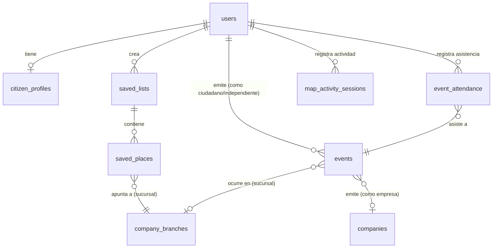

# Diseño de Base de Datos y Captura de Datos

Esta nota define el modelado de datos para las preferencias de usuario, favoritos, guardados, asistencia a eventos, y métricas de uso (como tiempo de actividad en el mapa). También propone qué otros datos de valor añadido podemos recopilar y cómo almacenarlos eficientemente usando **PostgreSQL (con PostGIS)** y **Redis**.

Documentos relacionados: [[Modelo de Cuentas y Roles]] | [[Arquitectura y Flujo de Usuarios]]

---

## 1. Diagrama de Relaciones de Usuario

El siguiente diagrama ilustra cómo se conectan las nuevas tablas orientadas al ciudadano (`citizen`) dentro de nuestro ecosistema central de base de datos.



---

## 2. Definición de Estructuras y Tablas SQL

### A. Preferencias del Usuario (`citizen_profiles.preferences`)
Para evitar esquemas rígidos y cambios costosos de migración en el futuro, las preferencias de los ciudadanos se almacenan en la columna `preferences` de tipo `JSONB` de la tabla `citizen_profiles`.

**Estructura sugerida para el JSONB:**
```json
{
  "theme": "dark", 
  "language": "es",
  "notifications": {
    "push_enabled": true,
    "near_events": true,
    "promotions": false
  },
  "travel_style": ["cultura", "gastronomia", "naturaleza"],
  "dietary_restrictions": ["vegano", "sin_gluten"],
  "accessibility_required": false,
  "transport_mode": "walking"
}
```

### B. Listas de Guardados y Favoritos (`saved_lists` & `saved_places`)
En lugar de crear tablas separadas para "Favoritos" y "Guardados", unificamos la funcionalidad para que el usuario pueda tener listas predeterminadas (como *"Favoritos"*) o personalizadas (como *"Cafeterías por visitar"*).

```sql
CREATE TABLE IF NOT EXISTS saved_lists (
    id SERIAL PRIMARY KEY,
    user_id INT NOT NULL REFERENCES users(id) ON DELETE CASCADE,
    name VARCHAR(100) NOT NULL, -- ej. "Mis Favoritos", "Parques para el fin de semana"
    description TEXT,
    is_public BOOLEAN DEFAULT false,
    created_at TIMESTAMP DEFAULT CURRENT_TIMESTAMP
);

CREATE TABLE IF NOT EXISTS saved_places (
    id SERIAL PRIMARY KEY,
    list_id INT NOT NULL REFERENCES saved_lists(id) ON DELETE CASCADE,
    branch_id INT REFERENCES company_branches(id) ON DELETE CASCADE, -- Si es un comercio local interno
    external_place_id VARCHAR(255), -- Si el lugar proviene de una API externa (ej. Google Places API)
    notes TEXT, -- Nota personal sobre por qué se guardó el lugar
    created_at TIMESTAMP DEFAULT CURRENT_TIMESTAMP,
    UNIQUE(list_id, branch_id, external_place_id)
);
```

### C. Eventos y Asistencia (`events` & `event_attendance`)
Permite a los usuarios marcar interés, confirmar asistencia o realizar un Check-In geoespacial cuando se encuentren en las coordenadas físicas del evento.

```sql
CREATE TABLE IF NOT EXISTS events (
    id SERIAL PRIMARY KEY,
    title VARCHAR(255) NOT NULL,
    description TEXT,
    start_time TIMESTAMP NOT NULL,
    end_time TIMESTAMP NOT NULL,
    category VARCHAR(100),
    geom GEOMETRY(Point, 4326), -- Ubicación espacial del evento (ej: coordenadas exactas o vía pública)
    
    -- Relación de Emisión (Polimórfica Relacional)
    emitter_type VARCHAR(50) NOT NULL CHECK (emitter_type IN ('citizen', 'independent', 'business')),
    user_emitter_id INT REFERENCES users(id) ON DELETE CASCADE, -- Si es emitido por un ciudadano o profesional independiente
    branch_emitter_id INT REFERENCES company_branches(id) ON DELETE CASCADE, -- Si es emitido por una sucursal comercial (restaurante, tienda, etc.)
    company_emitter_id INT REFERENCES companies(id) ON DELETE CASCADE, -- Si es emitido por la empresa matriz (ej. Mall)
    
    created_at TIMESTAMP DEFAULT CURRENT_TIMESTAMP,
    
    -- Restricción de Integridad para asegurar coherencia en el emisor
    CONSTRAINT chk_event_emitter CHECK (
        (emitter_type = 'citizen' AND user_emitter_id IS NOT NULL AND branch_emitter_id IS NULL AND company_emitter_id IS NULL) OR
        (emitter_type = 'independent' AND user_emitter_id IS NOT NULL AND branch_emitter_id IS NULL AND company_emitter_id IS NULL) OR
        (emitter_type = 'business' AND (branch_emitter_id IS NOT NULL OR company_emitter_id IS NOT NULL) AND user_emitter_id IS NULL)
    )
);

CREATE TABLE IF NOT EXISTS event_attendance (
    id SERIAL PRIMARY KEY,
    user_id INT NOT NULL REFERENCES users(id) ON DELETE CASCADE,
    event_id INT NOT NULL REFERENCES events(id) ON DELETE CASCADE,
    status VARCHAR(50) DEFAULT 'interested', -- 'interested', 'going', 'checked_in'
    checked_in_at TIMESTAMP, -- Marca de tiempo del Check-In físico real
    created_at TIMESTAMP DEFAULT CURRENT_TIMESTAMP,
    UNIQUE(user_id, event_id)
);
```

### D. Tiempo de Actividad en el Mapa (`map_activity_sessions`)
Monitorea la actividad del usuario en el mapa para entender la retención, engagement y comportamiento espacial.

```sql
CREATE TABLE IF NOT EXISTS map_activity_sessions (
    id SERIAL PRIMARY KEY,
    user_id INT NOT NULL REFERENCES users(id) ON DELETE CASCADE,
    session_start TIMESTAMP NOT NULL,
    session_end TIMESTAMP,
    duration_seconds INT DEFAULT 0,
    distance_traveled_meters FLOAT DEFAULT 0.0, -- Distancia aproximada recorrida en la app
    places_viewed_count INT DEFAULT 0, -- Lugares (POIs) clickeados
    device_info JSONB, -- Sistema operativo, resolución, versión de app
    created_at TIMESTAMP DEFAULT CURRENT_TIMESTAMP
);
```

---

## 3. Propuestas de Datos Premium a Obtener

Para elevar la aplicación a un nivel competitivo y premium (generando un efecto *WOW*), podemos capturar y almacenar las siguientes interacciones:

### 1. Historial de Búsquedas e Intereses (`user_search_history`)
*   **Datos:** Búsqueda textual y filtros aplicados (rango de precios, etiquetas).
*   **Propósito:** Personalizar la visualización del mapa priorizando marcadores afines.
```sql
CREATE TABLE IF NOT EXISTS user_search_history (
    id SERIAL PRIMARY KEY,
    user_id INT NOT NULL REFERENCES users(id) ON DELETE CASCADE,
    query_text VARCHAR(255) NOT NULL,
    filters_applied JSONB,
    clicked_branch_id INT REFERENCES company_branches(id) ON DELETE SET NULL,
    created_at TIMESTAMP DEFAULT CURRENT_TIMESTAMP
);
```

### 2. Reseñas y Aportes Multimedia (`reviews`)
*   **Datos:** Calificación (1-5 estrellas), comentarios escritos y URLs de imágenes subidas por el usuario.
*   **Propósito:** Crear una comunidad activa y dar confiabilidad social a los puntos de interés del mapa.
```sql
CREATE TABLE IF NOT EXISTS reviews (
    id SERIAL PRIMARY KEY,
    user_id INT NOT NULL REFERENCES users(id) ON DELETE CASCADE,
    branch_id INT NOT NULL REFERENCES company_branches(id) ON DELETE CASCADE,
    rating INT NOT NULL CHECK (rating BETWEEN 1 AND 5),
    comment TEXT,
    media_urls TEXT[], -- Array de URLs de almacenamiento en la nube (S3/Cloudinary)
    created_at TIMESTAMP DEFAULT CURRENT_TIMESTAMP
);
```

### 3. Sistema de Gamificación (`badges` & `user_badges`)
*   **Datos:** Logros predefinidos y su asignación a usuarios cuando cumplen ciertas metas (ej: visitar 5 museos o realizar 3 reportes).
*   **Propósito:** Aumentar el engagement mediante mecánicas lúdicas de exploración urbana.
```sql
CREATE TABLE IF NOT EXISTS badges (
    id SERIAL PRIMARY KEY,
    name VARCHAR(100) UNIQUE NOT NULL,
    description TEXT NOT NULL,
    icon_url VARCHAR(255) NOT NULL,
    requirement_type VARCHAR(50) NOT NULL -- 'visit_count', 'event_count', 'review_count'
);

CREATE TABLE IF NOT EXISTS user_badges (
    user_id INT NOT NULL REFERENCES users(id) ON DELETE CASCADE,
    badge_id INT NOT NULL REFERENCES badges(id) ON DELETE CASCADE,
    unlocked_at TIMESTAMP DEFAULT CURRENT_TIMESTAMP,
    PRIMARY KEY (user_id, badge_id)
);
```

### 4. Alertas del Mapa en Tiempo Real / Crowdsourcing (`map_reports`)
*   **Datos:** Alertas temporales de usuarios sobre el estado del entorno (congestión, cierres, eventos, problemas en la vía).
*   **Propósito:** Crear un mapa vivo y colaborativo en tiempo real. Estas alertas expiran automáticamente.
```sql
CREATE TABLE IF NOT EXISTS map_reports (
    id SERIAL PRIMARY KEY,
    user_id INT REFERENCES users(id) ON DELETE SET NULL,
    report_type VARCHAR(50) NOT NULL, -- 'congested', 'closed', 'special_event', 'incident'
    description TEXT,
    geom GEOMETRY(Point, 4326) NOT NULL, -- Uso de PostGIS para ubicación exacta
    upvotes INT DEFAULT 0, -- Votos de validez de otros usuarios
    created_at TIMESTAMP DEFAULT CURRENT_TIMESTAMP,
    expires_at TIMESTAMP NOT NULL
);
```

---

## 4. Estrategia de Almacenamiento (PostgreSQL vs Redis)

Para garantizar un rendimiento fluido del mapa en el móvil sin saturar el servidor, implementamos una estrategia híbrida:

1.  **Persistencia Transaccional (PostgreSQL):**
    *   *Preferencias, Favoritos, Historial, Eventos y Logros.* Son datos históricos o configuraciones del usuario que requieren transaccionalidad e integridad referencial estricta.
2.  **Caché y Escritura Diferida (Redis):**
    *   **Tiempo de Actividad (`map_activity_sessions`):** En lugar de hacer `UPDATE` a la base de datos PostgreSQL cada vez que el usuario se mueve o interactúa con el mapa, se acumula la sesión del usuario temporalmente en Redis. Al cerrar o pausar la aplicación, se hace un volcado (*flush*) final a PostgreSQL en un solo viaje.
    *   **Geolocalización Geoespacial Directa (`map_reports`):** Los reportes en tiempo real se almacenan en PostgreSQL para persistencia histórica, pero se cachean en Redis usando comandos **GEO (GEOADD, GEORADIUS)** para que las consultas de reportes cercanos al usuario móvil se respondan en menos de 5 milisegundos.
