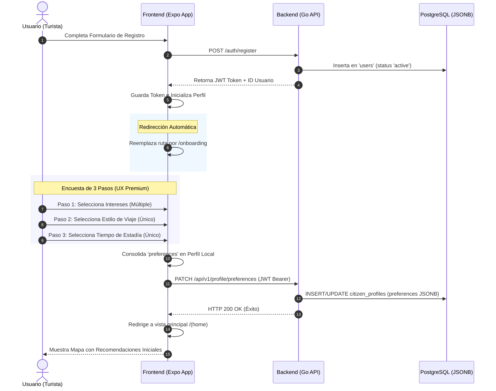

# Flujo Ideal: Registro y Onboarding de Preferencias de Usuario

Esta nota técnica define el **flujo ideal y de experiencia premium (UX)** para el proceso de Onboarding de nuevos usuarios. Su objetivo es recolectar de forma interactiva y sin fricciones las preferencias del turista inmediatamente después del registro, permitiendo alimentar el **Motor de Recomendación Predictivo** de la aplicación.

---

## 🗺️ Diagrama del Flujo de Onboarding Ideal

El flujo se divide en tres fases integradas: Registro, Encuesta de 3 Pasos en el cliente, y Persistencia Relacional y No Relacional (JSONB) en el Servidor.



---

## 🎨 Especificación de Diseño UI/UX (Pantalla de Onboarding)

Para lograr una experiencia **Premium**, la pantalla `app/onboarding.tsx` contará con un diseño moderno por slides y animaciones sutiles.

### Estructura de la Interfaz (3 Pasos)

#### 🌲 Paso 1: "¿Qué te apasiona de Valdivia?" (Intereses)
*   **Tipo de entrada:** Selección múltiple.
*   **Aestética:** Chips interactivos con gradientes, sombras suaves e iconos que se iluminan al seleccionarse:
    *   `nature` 🌲 Naturaleza y Humedales
    *   `beer` 🍺 Cervecerías Artesanales
    *   `food` 🍫 Chocolates y Gastronomía
    *   `history` 🏛️ Historia y Fuertes
    *   `river` ⛵ Paseos Fluviales
    *   `culture` 🎨 Arte y Cultura

#### 🎒 Paso 2: "¿Con quién vienes a explorar?" (Estilo de Viaje)
*   **Tipo de entrada:** Selección única.
*   **Aestética:** Tarjetas grandes con micro-animaciones al tacto (hover/press):
    *   `solo` 🎒 Explorador / Mochilero (Viaje en solitario)
    *   `couple` 💑 Escapada en Pareja (Romántico / Relax)
    *   `family` 👨‍👩‍👧‍👦 Familiar (Entretenimiento / Niños)
    *   `business` 💼 Negocios / Trabajo (Rápido / Conectividad)

#### 📅 Paso 3: "¿Cuánto tiempo te quedarás?" (Duración)
*   **Tipo de entrada:** Selección única.
*   **Aestética:** Selector horizontal animado:
    *   `day` ☀️ Solo por el día
    *   `weekend` 🚗 Fin de semana (2-3 días)
    *   `week` 📅 Una semana
    *   `long` 🗺️ Estadía prolongada

---

## 💾 Especificación de Datos y Modelo en Base de Datos

### 1. Payload de la API (JSON)
Cuando el usuario presiona "Finalizar", el cliente Expo envía la siguiente estructura HTTP:

*   **Ruta:** `PATCH /api/v1/profile/preferences`
*   **Headers:** `Authorization: Bearer <JWT_TOKEN>`
*   **Body:**
    ```json
    {
      "categories": ["nature", "beer", "food"],
      "travelStyle": "family",
      "stayDuration": "weekend"
    }
    ```

### 2. Estructura Relacional en PostgreSQL
Los datos de las preferencias se almacenan dentro de la tabla `citizen_profiles` usando una columna **JSONB** para una máxima flexibilidad sin alterar esquemas relacionales rígidos:

```sql
-- Tabla existente verificada en initDB()
CREATE TABLE IF NOT EXISTS citizen_profiles (
    user_id INT PRIMARY KEY REFERENCES users(id),
    phone VARCHAR(50),
    country VARCHAR(100),
    preferences JSONB -- Aquí se guarda el payload estructurado
);
```

#### Sentencia SQL de Persistencia (Upsert)
Para asegurar que el endpoint sea idempotente, el backend en Go ejecuta una consulta `INSERT ... ON CONFLICT DO UPDATE`:

```sql
INSERT INTO citizen_profiles (user_id, preferences)
VALUES ($1, $2)
ON CONFLICT (user_id)
DO UPDATE SET preferences = EXCLUDED.preferences;
```

---

## 🚀 Impacto en el Motor de Recomendación Predictivo (Fase 4)

Este flujo de onboarding recolecta la **información base inicial (Cold Start)**. Posteriormente, el backend en Go combinará este JSONB con las siguientes variables externas en tiempo real para generar pines y carruseles recomendados sobre el mapa:

1.  **Clima en Tiempo Real:** Si el clima en Valdivia es *Lluvioso* y el usuario tiene la preferencia `food` activa, el motor sugerirá cafeterías con chimenea o chocolaterías.
2.  **Hora del Día:** Si es de *Noche* y el usuario tiene `beer` activa, se priorizarán bares de cerveza artesanal en Isla Teja.
3.  **Proximidad Geográfica (PostGIS):** Eventos o atractivos turísticos cercanos que coincidan con la afinidad del perfil.
