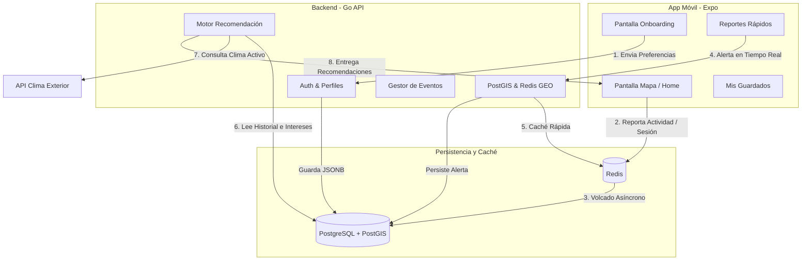

# Hoja de Ruta de Desarrollo y Conexiones del Sistema

Esta nota es el **mapa de ruta maestro (Roadmap)** para la implementación paso a paso de las funcionalidades avanzadas de nuestra app de turismo en Valdivia. Detalla las tareas técnicas ordenadas por prioridad, las dependencias y cómo se conectan el **Frontend (Expo)**, **Backend (Go)** y la **Base de Datos (PostgreSQL/Redis)**.

Documentos de referencia: [[Diseño de Base de Datos]] | [[Arquitectura y Flujo de Usuarios]]

---

## 🗺️ Mapa de Flujos Conectados

El siguiente diagrama muestra el flujo de datos desde que el usuario interactúa en la App móvil hasta que el motor de datos procesa y personaliza su experiencia en Valdivia:

---

## 📋 Lista de Tareas y Progreso de Desarrollo

### 🗄️ Fase 1: Migración e Infraestructura de Datos
*Objetivo: Sentar las bases físicas en PostgreSQL y Redis para almacenar la información.*

- [ ] **1.1. Diseñar y ejecutar las migraciones en PostgreSQL:**
  - [ ] Crear tablas de `saved_lists` y `saved_places`.
  - [ ] Crear tablas de `events` (con soporte polimórfico para emisión por Ciudadano, Independiente y Empresa) y `event_attendance` con soporte de datos geográficos PostGIS.
  - [ ] Crear tablas de analítica: `map_activity_sessions` y `user_search_history`.
  - [ ] Crear tablas de gamificación y reportes en tiempo real (`badges`, `user_badges` y `map_reports`).
- [ ] **1.2. Configurar índices y extensiones espaciales:**
  - [ ] Asegurar que la extensión `postgis` esté activa.
  - [ ] Crear índice espacial `GIST` en `events.geom` y `map_reports.geom` para búsquedas espaciales ultrarrápidas.
- [ ] **1.3. Configurar persistencia y almacenamiento en Redis:**
  - [ ] Crear estructura de almacenamiento temporal para las sesiones de actividad.
  - [ ] Configurar soporte geoespacial de Redis (`GEOADD`, `GEORADIUS`) para alertas en tiempo real.

---

### 🌐 Fase 2: Desarrollo del Backend (Endpoints en Go)
*Objetivo: Desarrollar la lógica de negocio y las APIs transaccionales y de consulta.*

- [x] **2.1. Módulo de Perfiles y Preferencias:**
  - [x] Endpoint `PATCH /api/v1/profile/preferences` para actualizar el JSONB de preferencias del ciudadano.
- [ ] **2.2. Módulo de Favoritos y Guardados:**
  - [ ] Endpoint `POST /api/v1/favorites/lists` para crear nuevas listas de guardados.
  - [ ] Endpoint `POST /api/v1/favorites/places` para guardar sucursales o lugares externos en una lista.
  - [ ] Endpoint `GET /api/v1/favorites` para obtener las listas del usuario autenticado.
- [ ] **2.3. Módulo de Eventos y Asistencia Física:**
  - [ ] Endpoint `POST /api/v1/events` para la creación de eventos (validando que el emisor coincida con su tipo de perfil: ciudadano, independiente o empresa).
  - [ ] Endpoint `GET /api/v1/events/near` para listar eventos cercanos usando PostGIS.
  - [ ] Endpoint `POST /api/v1/events/attend` para registrar interés o asistencia (`interested`, `going`).
  - [ ] Endpoint `POST /api/v1/events/checkin` que valide mediante la distancia por coordenadas GPS si el usuario está físicamente en el evento para marcar asistencia confirmada.
- [ ] **2.4. Módulo de Analítica y Sesión:**
  - [ ] Endpoint `POST /api/v1/map/session/start` y `POST /api/v1/map/session/end` para abrir y cerrar el registro de actividad.
  - [ ] Endpoint `POST /api/v1/map/session/track` para acumular eventos de interacción en Redis de forma temporal.
- [ ] **2.5. Módulo de Reportes en Tiempo Real (Crowdsourcing):**
  - [ ] Endpoint `POST /api/v1/reports` para que los usuarios publiquen alertas en el mapa.
  - [ ] Endpoint `GET /api/v1/reports/near` que retorne las alertas vigentes en un radio de metros (consultando Redis GEO).
  - [ ] Tarea cron (background) en Go que limpie reportes cuya fecha `expires_at` haya pasado.

---

### 📱 Fase 3: Interfaz Móvil y Flujos UX (React Native / Expo)
*Objetivo: Integrar los componentes del mapa y las pantallas con las nuevas APIs de manera interactiva.*

- [x] **3.1. Flujo de Onboarding de Preferencias:**
  - [x] Crear pantalla interactiva de bienvenida donde el usuario selecciona sus intereses principales en Valdivia (ej. Cerveza artesanal, Naturaleza, Chocolates, Historia).
  - [x] Conectar la pantalla con el endpoint de perfil.
- [ ] **3.2. Panel de Guardados y Favoritos:**
  - [ ] Diseñar el panel flotante de "Mis Lugares Guardados".
  - [ ] Permitir la creación de colecciones personalizadas y añadir notas.
- [ ] **3.3. Integración de Eventos en el Mapa:**
  - [ ] Mostrar pines especiales con animaciones sutiles para eventos activos.
  - [ ] Ficha del evento con botón de asistencia y confirmación de Check-in usando la ubicación GPS en tiempo real del dispositivo móvil.
- [ ] **3.4. Monitor de Actividad en el Mapa:**
  - [ ] Implementar un hook de React Native (`useMapSession`) que detecte cuándo el mapa está activo en pantalla, el tiempo de uso y envíe reportes de actividad al backend de forma optimizada para no gastar batería ni datos móviles.
- [ ] **3.5. Formulario de Reportes Rápidos (Crowdsourcing):**
  - [ ] Botón flotante de reporte rápido en el mapa (icono de exclamación o Waze-style).
  - [ ] Formulario simplificado con opciones: *"Mucha Gente / Congestión"*, *"Evento en la Vía"*, *"Local Cerrado"*.
  - [ ] Geolocalización automática mediante GPS del celular al enviar el reporte.

---

### ❄️ Fase 4: Inteligencia de Datos y Algoritmo Predictivo
*Objetivo: Unir los datos para personalizar la experiencia.*

- [ ] **4.1. Integración de API de Clima en el Backend de Go:**
  - [ ] Conectar un servicio de clima (ej: OpenWeatherMap API) para capturar las condiciones meteorológicas actuales de Valdivia.
- [ ] **4.2. Motor de Recomendación Híbrido:**
  - [ ] Programar en Go la lógica que calcula la afinidad de categorías basándose en:
    *   `Preferencias directas` del usuario.
    *   `Historial de búsquedas` e interacciones.
    *   `Contexto físico`: Clima actual + Hora del día + Cercanía geográfica.
- [ ] **4.3. Implementar Carrusel de Recomendaciones Inteligentes:**
  - [ ] Crear un componente en el frontend en la Home o sobre el mapa que muestre sugerencias hiper-personalizadas de acuerdo al estado del día (ej: *"Día lluvioso: Cafeterías con chimenea recomendadas"* o *"Tarde despejada: Explora la costa y humedales"*).
